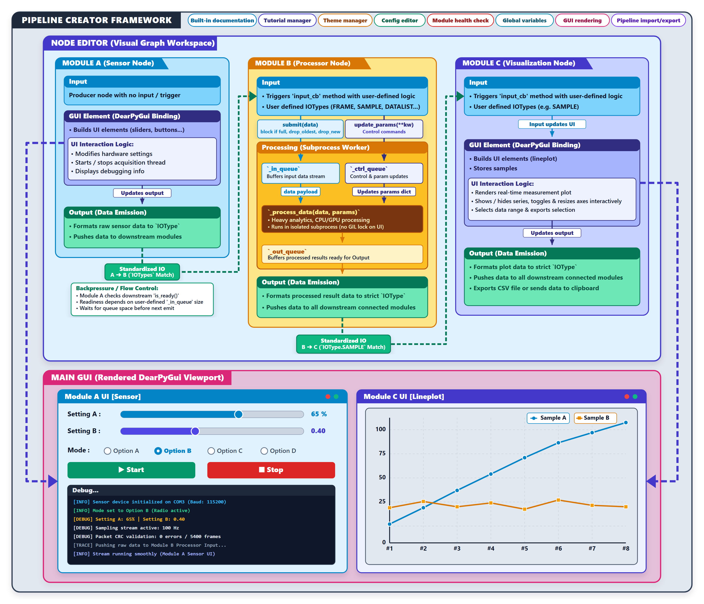
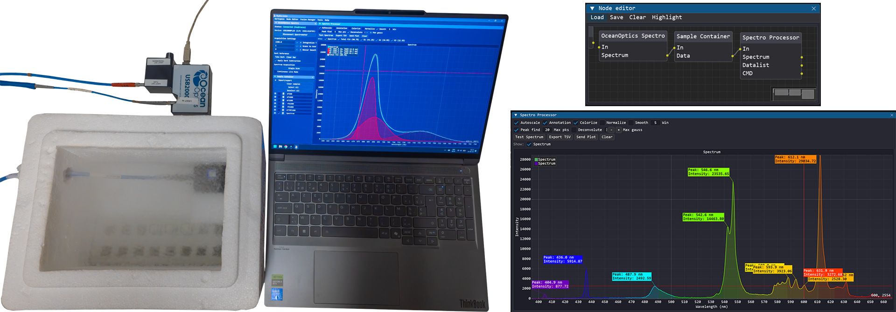
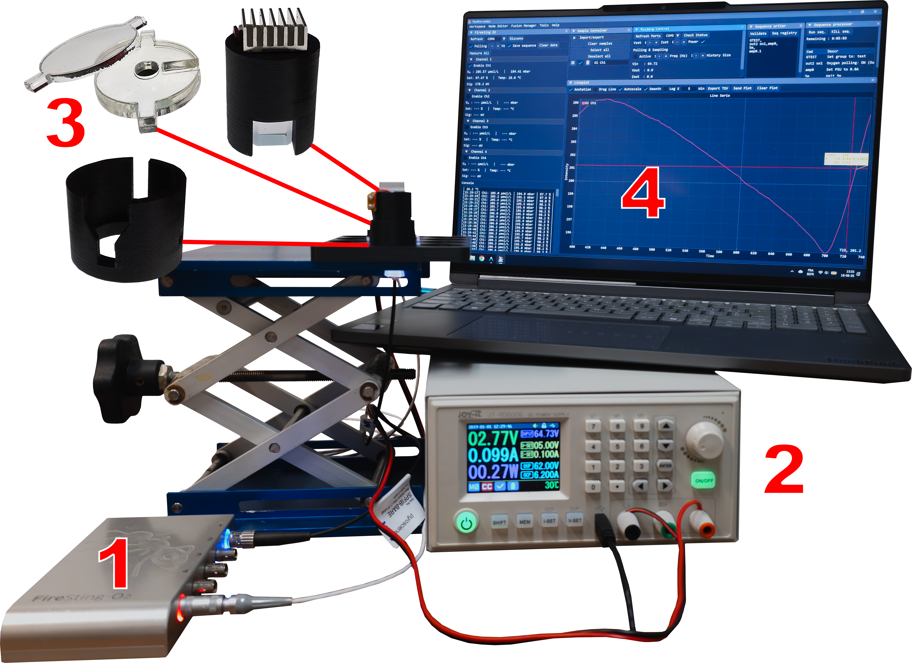
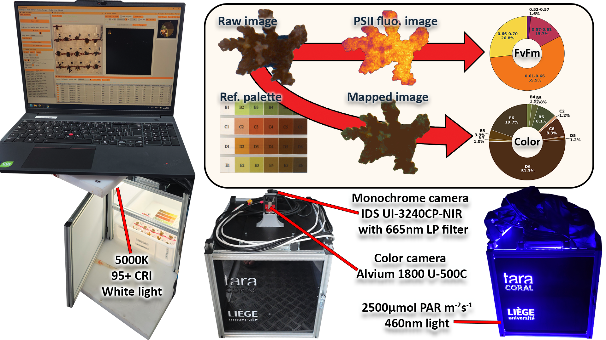
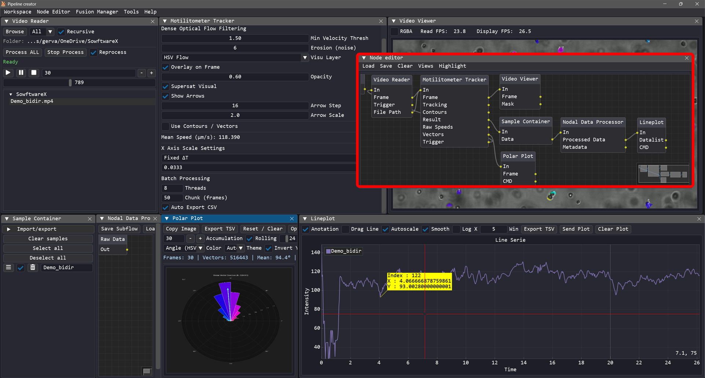

<div align="center">

# Pipeline Creator

**A modular, low-code/no-code node-based GUI toolkit for instrument control and scientific data processing.**

[](https://www.python.org/)
[](https://github.com/hoffstadt/DearPyGui)
[](LICENSE)
[](https://n3odym3.github.io/Pipeline_creator/)

</div>

---

## Overview

**Pipeline Creator** is a toolkit for building desktop applications visually. You open a node editor, you drop modules on a canvas, you wire them together, and you get a working graphical interface.

A module is just a Python file with an input, outputs, and a window. You write the logic, Pipeline Creator handles the rest: the layout, the connections between modules, and running heavy tasks in the background so the interface never freezes.

You can save your whole setup (nodes, wires, window positions, settings) as a JSON file and reload it later or share it. The **Tutorial Manager** lets you record step-by-step guides for en user. The **Fusion Manager** groups windows into tabs to keep things tidy. And a privilege system (`User`, `Advanced`, `Dev`) controls who sees what.

The project started in a research lab, inspired by [**Node-RED**](https://github.com/node-red/node-red) but designed for hardware control and complete local interfaces running on a PC. That said, Pipeline Creator is not limited to academic or scientific use. If something can be done in Python, it can be turned into a module. The point is to save time, standardize how things are built, and let people reuse and share modules developed by others.

---

## Who Is It For?

Pipeline Creator is designed to support three distinct user profiles:

- **Users:**  
  Interact with clean, locked-down dashboards without ever seeing code or complex wiring diagrams. The built-in **Tutorial Manager** guides users step-by-step through physical setups, calibration, and experimental runs while enforcing prerequisite checks.

- **Pipeline Designers (Low-Code):**  
  Assemble complete application logic by selecting, arranging, and connecting pre-existing modules on the visual canvas. Export the final workflow as a portable JSON workspace that automatically becomes the operator's interface.

- **Module Developers (Python):**  
  Write standard Python code using built-in boilerplate-free templates to integrate new hardware (Serial, Modbus, USB, Cameras), data processing routines (NumPy, OpenCV, PyTorch), or custom UI elements. Modules are hot-loaded and auto-discovered instantly.

> [!WARNING]
> **Core Framework Only**  
> This repository contains only the core Pipeline Creator framework, a few basic modules, and a demo pipeline that acts as a "Hello World" example. Running the application out of the box provides limited functionality.
>
> To build real-world setups, you need to add functional modules to the `modules/` directory.
>
> **Available Module Repositories (WIP):**
> - [Community Hardware & Device Modules](https://github.com/) *(coming soon)*
> - [Data Processing & Analysis Modules](https://github.com/) *(coming soon)*
> - [Custom Instrument Drivers](https://github.com/) *(coming soon)*

---

## Architecture

<p align="center">
  
</p>

Pipeline Creator operates across four interconnected core layers:

1. **User Interface & Application Management:** Powered by [**DearPyGui**](https://github.com/hoffstadt/DearPyGui) with centralized window docking (*Fusion Manager*), customizable themes, and a dynamic 3-tier privilege system (`User`, `Advanced`, `Dev`).
2. **Node Framework:** Visual wiring between inputs and outputs, dynamic module discovery, and portable flow serialization (JSON).
3. **Data Communication:** Hybrid routing combining direct node-to-node data pipelines with a global **Link Bus** (Zero-Wire Routing) for decoupled messaging.
4. **Execution & Concurrency:** Main GUI thread isolation paired with background multiprocessing for compute-intensive tasks, live camera feeds, and hardware drivers.

---

## Key Features

- **Visual Node Canvas:** Connect modular blocks graphically to build complex execution pipelines.
- **Fusion Manager (Docking & Layouts):** Group and dock multiple floating windows into organized, tabbed views.
- **Link Bus (Zero-Wire Routing):** Route global data streams between distant modules without cluttering the canvas.
- **Process Isolation:** Offload heavy computations and live acquisition to background processes to keep the UI smooth at high FPS.
- **Role-Based Access Control:** Switch between `User` (locked down operator UI), `Advanced`, and `Dev` modes.
- **Startup Automation & Scripting:** Automate entire experimental protocols, device calibration routines, and layout initialization.
- **Interactive Tutorial Engine:** Create interactive tutorials that highlight UI elements and enforce prerequisite actions before continuing.
- **Standalone Deployment:** Compile into a self-contained executable via Nuitka for deployment on machines without a Python environment.

---

## Real-World Scientific Examples

<details open>
<summary><b>1. Automated Spectroscopy & Live Peak Deconvolution</b></summary>

<br>

<p align="center">
  
</p>

* **Hardware:** Ocean Optics USB2000+ Spectrometer & 450 nm LED source.
* **Pipeline:** Interconnected spectrometer driver, sample container, and live spectral processor.
* **Application:** Real-time 77 K microalgae fluorescence deconvolution. The processor continuously separates overlapping emission bands to isolate individual Photosystem I (PSI) and Photosystem II (PSII) contributions directly inside the live acquisition loop.

</details>

---

<details open>
<summary><b>2. Multi-Instrument Oxygen Exchange & Respiration Monitor</b></summary>

<br>

<p align="center">
  
</p>

* **Hardware:** FireSting-O2 optical meter (OXSP5 sensor spot), Joy-It programmable LED power supply, custom 3D-printed cuvette.
* **Pipeline:** Multi-device synchronization with automated scripting orchestrating illumination cycles.
* **Application:** Time-aligned monitoring of *Chlamydomonas reinhardtii* photosynthetic oxygen evolution and dark respiration, fully controlled via human-readable automated scripts.

</details>

---

<details open>
<summary><b>3. Field Coral Thermal Resilience Imaging (Tara Expedition)</b></summary>

<br>

<p align="center">
  
</p>

* **Hardware:** Dual-modal system combining high-resolution colorimetry (5000K LED) and NIR chlorophyll fluorescence (460 nm pulse driver).
* **Pipeline:** On-site AI segmentation using the Segment Anything Model (SAM) for color analysis and fast contour tracking for $F_v/F_m$ extraction.
* **Application:** Deployed aboard the *Tara* schooner for standardized CBASS bleaching assays, leveraging role-based permissions and tutorials for rapid rotation among international science crews.

</details>

---

<details open>
<summary><b>4. Microalgal Motility & Cell Tracking Dashboard</b></summary>

<br>

<p align="center">
  
</p>

* **Modernization:** Replaces a legacy command-line tool with a fully interactive graphical dashboard.
* **Pipeline:** Real-time video playback and dynamic parameter tuning for tracking algorithms.
* **Application:** Live extraction of swimming speeds (line plots), vector distributions (histograms), and phototactic swimming directionality (polar plots).

</details>

---

## Quick Start

### Installation

```bash
# Clone the repository
git clone https://github.com/n3odym3/Pipeline_creator.git
cd Pipeline_creator

# Install dependencies
pip install -r requirements.txt
# Or :
pip install dearpygui loguru numpy pillow numpy
```

### Launching the Application

```bash
python main.py
```

---

## 📖 Documentation

For full guides, module references, and developer tutorials, check out the comprehensive [Documentation Wiki](https://n3odym3.github.io/Pipeline_creator/).

---

## 📄 License

This project is licensed under the [MIT License](LICENSE).
