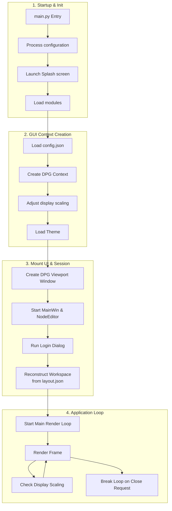
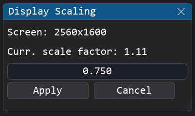
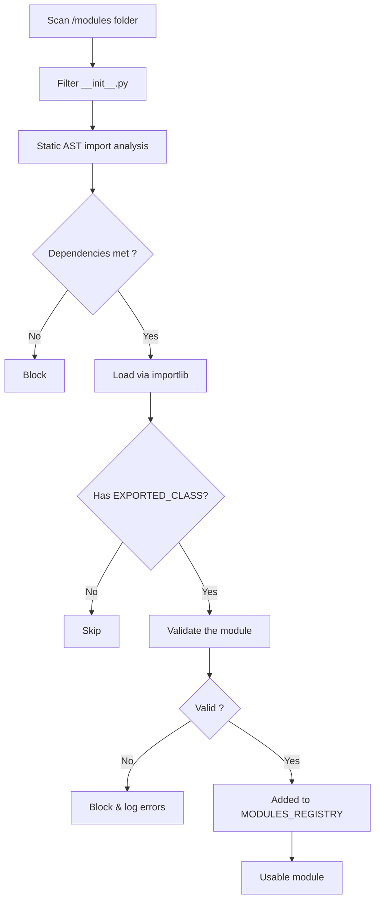

# <u>Architecture Overview</u>

This page describes the internal architecture of Pipeline Creator : how the application starts, manages state, handles scaling, and routes data between modules.

## <u>Boot Sequence</u>

The application lifecycle starts at `main.py` and proceeds through four distinct phases:



### Key Boot Stages

1. **DPI Awareness** : Before importing DearPyGui, the app calls the Windows `SetProcessDpiAwareness` API to prevent blurry rendering on high-DPI screens.
2. **Isolated Splash** : A `tkinter`-based splash screen runs in a **separate process** so it stays animated while heavy DPG initialization happens in the main process.
3. **Frame Pumping** : While the blocking Login Modal is active before the main loop, DPG renders frames manually with `dpg.render_dearpygui_frame()` to keep the window responsive.

---

## <u>App State (`app_state.py`)</u>

A global singleton that tracks the session context, accessible from any module. You can also define and add custom attributes to this singleton if your modules need to exchange global status or state flags between each other:

```python
from core.app_state import app_state

# Read the current mode
if app_state.mode == "dev":
    show_debug_panel()

# Check if login is complete
if app_state.login_done:
    enable_workspace_features()
```

| Attribute | Type | Description |
|---|---|---|
| `username` | `str` | The logged-in profile name |
| `mode` | `str` | Privilege mode: `"user"` \| `"advanced"` \| `"dev"` |
| `login_done` | `bool` | Blocks UI bypass before the login dialog completes |
| `close_requested` | `bool` | Set to `True` to trigger graceful shutdown |

---

## <u>Display Scaling (`display_scaling.py`)</u>

Pipeline Creator adapts layouts and font sizes dynamically when running on screens with different DPI ratings or when the window is moved to a different monitor.

### Percentage-Based Geometry

Window positions and sizes are saved as **screen percentages** rather than pixel values. This makes layouts portable across different resolutions:

**pos_pct** = (**pos_px** / **viewport_size**) × 100.0

On load, percentages are re-multiplied by the current viewport size to recover pixel positions.

### Multi-Monitor Adaptation

In the main render loop, the viewport position is cached each frame. If the window moves to a different monitor:

1. `display_scaling.adapt_to_display()` detects the new monitor's native resolution.
2. A scale factor is computed relative to the 1080p baseline (e.g., `2.0` for 4K).
3. Fonts and window bounds are proportionally rescaled.

You can also trigger this manually via **Tools → Adapt Display Scaling**.



!!! note "Manual Scaling Adjustment"
    The scaling control slider allows you to apply a manual scaling multiplier on top of the automatic DPI calculation, enabling you to manually enlarge or shrink the final rendered UI layout.

## <u>Fonts (`merge_fonts.py`)</u>
By default, the program uses the **Consolas** font (`consola.ttf`) for text rendering. To enrich the graphical user interface, **FontAwesome** is also utilized to display icons. However, DearPyGui is unable to use multiple font files simultaneously on the same item; it can only switch between fonts.

To overcome this limitation, the script `/tools/merge_fonts.py` uses `fonttools` to merge the Unicode character mappings of both fonts, creating a hybrid font called `consola_awesome.ttf`. This custom unified font retains Consolas for text rendering while embedding FontAwesome's icon glyphs. This allows any module to display icons inline next to text by referencing standard FontAwesome Unicode characters (which can be found on [fontawesome.com](https://fontawesome.com/)).


## <u>Module Registry (`module_registry.py`)</u>

The registry is the central directory of all loaded module instances and class definitions. Its main purpose is to discover and validate all modules located in the `/modules` directory, registering and listing every available option so that the [Node Editor](node_editor_guide.md) can use them.

This discovery and validation pipeline runs automatically at startup. This enables you to add new modules to the software simply by dropping them into the `/modules` directory. To be successfully loaded, modules must adhere to the [Developer Best Practices](developer_guide.md#developer-best-practices), and all their required dependencies must be installed on the system. To ensure application stability and prevent runtime crashes, the registry only registers and exposes **fully valid** modules; any incorrect or broken modules are skipped and reported.

### Discovery Pipeline



### Static Dependency Pre-Check

Before importing any module file, the registry performs an **AST (Abstract Syntax Tree)** scan to extract all `import` and `from ... import` statements. This detects missing packages like `numpy` or `opencv-python` *before* attempting to load the file, preventing runtime `ImportError` crashes.

### Key Registry Functions

| Function | Description |
|---|---|
| `get_available_modules()` | List all successfully loaded module classes |
| `get_registered_modules()` | List all active module *instances* |
| `load_workspace(path)` | Deserialize and reconstruct a flow JSON file |
| `export_workspace(path)` | Serialize the current graph to a flow JSON file |
| `apply_view(mode)` | Apply the saved window layout for a privilege mode |

---

## <u>Module Health Check (`module_health_manager.py`)</u>

During the startup discovery process, the `ModuleHealthManager` coordinates sanity checks on all discovered modules. If issues are found, it blocks the startup flow and displays a tabbed **Module Health Check** dialog to the user.

Issues are categorized by severity levels which determine whether a module is loaded or excluded from the [Module Registry](#module-registry-module_registrypy):

### Missing Dependencies Tab

If a module references Python libraries that are not installed on the system (e.g., `numpy` or `opencv-python`), the registry blocks the module from loading to prevent runtime `ImportError` crashes.
* **Auto-Recovery**: The dialog lists the missing packages and displays an **Install** button next to each package name, as well as an **Install All** button.
* **Action**: Clicking these buttons triggers a background `pip install` for the specified packages.
* **Requirement**: Once the installation completes, a restart of the application is required to reload the new packages.

### Validation Errors Tab

The second tab displays any violations of the [Developer Best Practices](developer_guide.md#developer-best-practices) discovered during static code analysis. Issues have different severity levels:

* **ValidationLevel.WARNING**: The issue is minor (e.g., small stylistic inconsistencies). The module is marked with a warning but remains **fully usable** in the Node Editor.
* **ValidationLevel.ERROR**: The violation is critical and likely to prevent the module from operating safely (e.g., using duplicate DearPyGui tags instead of suffixing with `self.UUID`). The module is **excluded** from the registry and cannot be used until the code is corrected.

---

## <u>Node Editor Graph System (`node_editor.py`)</u>

Once modules are loaded and validated successfully, they are registered and available to be instantiated inside the Node Editor visual graph. The Node Editor provides a zoomable, pannable graphical canvas built on top of DearPyGui where users can visually organize and interconnect module nodes. It coordinates:

- **Connection Type Validation**: Wires drawn between terminals are automatically validated against `IOTypes` to ensure data compatibility.
- **Workspace Persistence**: The entire visual state, module parameters, node coordinates, and connection paths are serialized to JSON.
- **Interaction Handlers**: Double-clicking a node automatically brings its corresponding GUI window to the foreground, while right-clicking a node pops up options such as renames, deletions, and tutorials.

The visual graph is managed by [`NodeEditor`](node_editor_guide.md) which inherits from four mixins:

```mermaid
graph BT
    NodeHighlightMixin[NodeHighlightMixin<br>Visual theme coloring] --> NodeEditor
    NodePopupMixin[NodePopupMixin<br>Fuzzy search popup] --> NodeEditor
    NodeCallbacksMixin[NodeCallbacksMixin<br>DPG mouse & link events] --> NodeEditor
    NodeSerializationMixin[NodeSerializationMixin<br>Save & load workspaces] --> NodeEditor
    classDef mixin fill:#1a4d4d,stroke:#33b2b2,stroke-width:2px;
    class NodeHighlightMixin,NodePopupMixin,NodeCallbacksMixin,NodeSerializationMixin mixin;
```



* **NodePopupMixin**: Builds the right-click module selection menu and manages the fuzzy search list.
* **NodeCallbacksMixin**: Processes link creation, link deletion, double-clicks, and handles warning modals when mismatching type connections are attempted.
* **NodeHighlightMixin**: Governs highlighting downstream nodes, dimming unconnected modules, and drawing dashed *virtual links* between wireless Link In / Link Out channels.
* **NodeSerializationMixin**: Exports active configurations to file and handles regenerating the graph upon launch.
