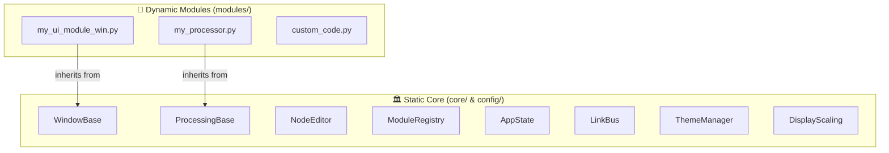
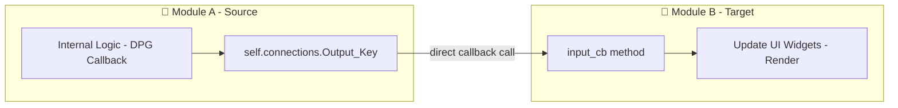
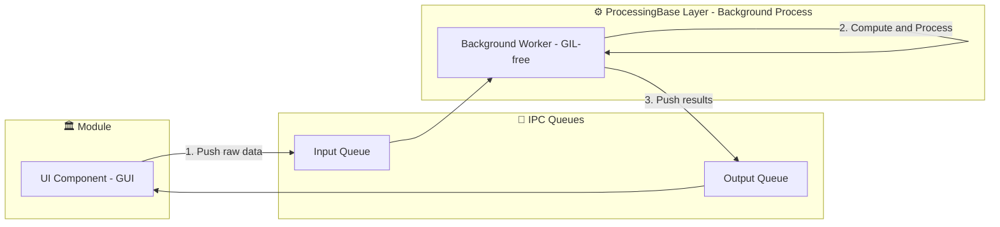

# Core vs Dynamic Modules

Pipeline Creator's codebase is cleanly divided into two layers: the **static core framework** that is never modified by users, and the **dynamic module ecosystem** where all project-specific work happens.

---

## The Two Layers at a Glance



---

## Static Core (`core/` and `config/`)

The **static core** is the framework. You should **never need to modify** these files unless you are changing fundamental application behavior.

### Core Services

| File | Purpose |
|---|---|
| `core/window_base.py` | Base class for all visual UI node modules |
| `core/processing_base.py` | Base class for background multiprocess workers |
| `core/node_editor.py` | Visual graph canvas, link handling, minimap |
| `core/module_registry.py` | Module discovery, loading, validation, serialization |
| `core/app_state.py` | Global session state singleton |
| `core/link_bus.py` | Publish/subscribe zero-wire data broker |
| `core/node_highlight.py` | Downstream graph highlighting & dimming |
| `core/node_popup.py` | Right-click module search popup |
| `core/node_callbacks.py` | DPG mouse event & link event handling |
| `core/node_serialization.py` | Flow JSON save/load & graph reconstruction |
| `core/login_dialog.py` | Login/profile dialog at startup |
| `core/main_win.py` | Main window menu bar & host container |
| `core/fusion_manager.py` | Tab-docking for module panel fusion |
| `core/dependency_manager.py` | Missing package detection & reporting |
| `core/module_validation_manager.py` | Post-load module contract enforcement |
| `core/automation_manager.py` | JSON script-driven startup automation |
| `core/input_output_types.py` | `IOTypes` enum for typed terminal connections |
| `core/tutorial_manager.py` | In-app guided tutorial system |
| `core/system_tray.py` | System tray icon & context menu |
| `core/splash.py` | Isolated splash screen process |
| `core/paths.py` | Centralized project path constants |

### Config Layer

| File | Purpose |
|---|---|
| `config/config.json` | User-editable application settings |
| `config/config.py` | Safe JSON loader with defaults |
| `config/theme_manager.py` | Theme/palette loading & font management |
| `config/theme_colors.py` | All color palette dictionaries |
| `config/theme_factory.py` | DPG theme item builders |
| `config/display_scaling.py` | DPI detection & multi-monitor scaling |

---

## Dynamic Modules (`modules/`)

The **dynamic module layer** is where you do all your project-specific work. Modules are Python files placed anywhere inside the `/modules` directory tree.

### Module Types

| Type | Base Class | Use Case |
|---|---|---|
| **UI Node** | `WindowBase` | Interactive panels, charts, controls, viewers |
| **Processor** | `ProcessingBase` | CPU-bound background computation |
| **Hybrid** | `WindowBase` + embedded `ProcessingBase` | A UI panel that owns a background worker |

### Discovery Contract

For the registry to discover your module, the file must expose:

```python
# At module level (not inside a class or function)
EXPORTED_CLASS = MyModuleClass   # The class to instantiate
EXPORTED_NAME  = "My Module"     # Display name in the search popup
```

Optionally, a category can be specified. If not, the folder name is used as the category.

### Module Isolation Guarantee

Each module instance is completely isolated:

- Its own **UUID** prevents DPG tag collisions.
- Its own **subprocess** (if using `ProcessingBase`) prevents GIL interference.
- Its own **`close()` method** ensures cleanup on shutdown.

---

## Base Classes: `WindowBase` vs `ProcessingBase`

All dynamic modules in Pipeline Creator inherit from one of two core base classes defined in the static framework. These classes determine the execution context, thread safety, and responsibilities of the module.

### Core Differences

| Feature | `WindowBase` | `ProcessingBase` |
|---|---|---|
| **Primary Purpose** | Front-end GUI rendering, interactive charts, and user controls | Background computation, CPU-bound processing, and hardware polling |
| **Execution Thread** | Runs in the **Main Thread** (GUI Thread) | Runs in an isolated **Subprocess** (to bypass Python's GIL) |
| **Direct DPG Access** | Yes (can draw widgets, windows, handle UI events) | No (attempting to call `dearpygui` functions will fail/crash) |
| **Blocking Safety** | Non-safe (long-running loops will freeze the entire UI) | Safe (operates asynchronously without affecting GUI responsiveness) |
| **Communication** | Direct callbacks | Thread-safe multiprocessing Queues (IPC) |

### Communication Flows

There are two primary ways modules interact within Pipeline Creator, depending on whether the communication occurs between different UI modules or internally between a UI node and its background worker.

#### 1. Module-to-Module Communication (Direct Callbacks)

When you connect two nodes on the visual graph canvas, data is transmitted synchronously on the main thread using direct callbacks. For a deeper look at defining input callbacks and output connections, refer to the [UI Node Developer Guide](dev_ui_node.md).
1. The target module (Module B) is registered inside the source module's (Module A) `self.connections[output_name]` dictionary.
2. When Module A generates new data, it loops over all registered target modules and calls their `input_cb()` method directly.
3. Module B receives the data via `input_cb(data, data_type)`, updates its internal state, and refreshes its GUI widgets.



#### 2. Hybrid Modules (Asynchronous IPC)

A **Hybrid Module** consists of a visual `WindowBase` layer running in the main thread (GUI) that instantiates and manages an isolated background `ProcessingBase` worker (Subprocess). This allows creating responsive nodes (like video players or real-time trackers) where user controls configure parameters dynamically while a background process handles the high-frequency calculation frame-by-frame. For advanced details on background process loops, queues, and subprocess lifecycle, see the [Background Processor Developer Guide](dev_processor_node.md).

The `WindowBase` UI layer and the `ProcessingBase` worker communicate asynchronously using thread-safe Inter-Process Communication (IPC) queues:
1. The `WindowBase` UI component pushes raw data or parameters into the `Input Queue`.
2. The background `ProcessingBase` worker pulls the data from the queue, performs calculations, and pushes the results into the `Output Queue`.
3. The `WindowBase` UI component pulls the processed results from the `Output Queue` and updates the GUI widgets.



---

!!! tip "Developer Documentation"
    For detailed guidelines on how to subclass these base classes, check the following resources:
    - [Developer Guide](developer_guide.md)
    - [Creating a UI Node with WindowBase](dev_ui_node.md)
    - [Creating a Processor with ProcessingBase](dev_processor_node.md)

---

## Separation Rules

| Action | Where? |
|---|---|
| Add a new visualization panel | `modules/your_category/name_win.py` |
| Add a new background processor | `modules/your_category/name_proc.py` |
| Change how modules are discovered | `core/module_registry.py` |
| Add a new color theme | `config/theme_colors.py` |
| Add a new menu item to the main bar | `core/main_win.py` |
| Change how link types are validated | `core/input_output_types.py` |
| Add a new IOType | `core/input_output_types.py` → `IOTypes` enum |

!!! warning "Never modify core files for project-specific logic"
    Project-specific logic should **always** live in `modules/`. Modifying core files risks breaking the framework for all other modules. If you find yourself needing a core change, consider whether the module can use `input_cb`, the `link_bus`, or a custom callback instead.
