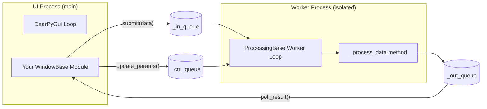

# Creating a Background Processor (`ProcessingBase`)

If your module performs CPU-intensive work (image processing, mathematical transforms, file scanning, serial communication loops), you must offload it to an isolated **background process** using `ProcessingBase`. This keeps the DPG render loop smooth and the UI frame rate stable.

---

## Why a Separate Process?

Python's **Global Interpreter Lock (GIL)** means that threads cannot truly run Python code in parallel. A heavy computation in a thread will still stall the UI thread.

`ProcessingBase` uses `multiprocessing`, which spawns a **separate OS process** with its own Python interpreter and memory space, completely bypassing the GIL.



---

## File Location

```
modules/<your_category>/<your_module_name>_proc.py
```

Convention: suffix the filename with `_proc` to indicate it is a background worker.

!!! note
    A processor is not a standalone module, it is meant to be **embedded inside a UI node** (`WindowBase` subclass) that manages the process lifecycle.

---

## Minimal Template

```python
from __future__ import annotations
from typing import Any, Dict, Optional
from core.processing_base import ProcessingBase


class MyProcessor(ProcessingBase):
    """
    Background worker that processes data in an isolated process.
    Override _process_data() with your computation logic.
    """

    def __init__(
        self,
        params: Optional[Dict[str, Any]] = None,
        *,
        buffer_size: int = 10,
        drop_policy: str = "drop_oldest",
        daemon: bool = True,
    ) -> None:
        super().__init__(
            params=params,
            buffer_size=buffer_size,
            drop_policy=drop_policy,
            daemon=daemon,
        )

    def _process_data(self, data: Any, params: Dict[str, Any]) -> Any:
        """
        Executed inside the isolated worker process.

        WARNING: This method runs in a different process.
        - Do NOT access DPG (dpg.*) from here.
        - Do NOT modify shared module state directly.
        - Only communicate via the return value (sent to _out_queue).

        Args:
            data:   Input data packet (submitted from the UI process).
            params: Snapshot of current parameters (from update_params()).

        Returns:
            Any result to deliver back to the UI process via _out_queue.
            Return None to discard the result.
        """
        multiplier = params.get("multiplier", 1.0)

        if isinstance(data, (int, float)):
            return {"status": "ok", "value": data * multiplier}

        return {"status": "skipped"}
```

---

## `ProcessingBase` Contract

### Starting and Stopping

```python
processor = MyProcessor(params={"multiplier": 2.0})
processor.start()    # Launch the background process
# ... later ...
processor.stop()     # Terminate gracefully
```

### Submitting Data

```python
processor.submit(my_data)
```

Data is placed into the `_in_queue`. If the queue is full, behavior depends on the `drop_policy`:

| Policy | Behavior |
|---|---|
| `"drop_new"` | Discard the new packet (keep processing old ones) |
| `"drop_oldest"` | Remove the oldest queued packet, insert the new one |
| `"block"` | Wait until space is available (may stall the UI thread) |

### Polling Results

```python
result = processor.poll_result()
if result is not None:
    # Handle result from the worker process
```

Call `poll_result()` in your UI node's update loop or a DPG callback to retrieve processed data.

### Updating Parameters

```python
processor.update_params({"multiplier": 3.5})
```

Parameters are sent to the worker via `_ctrl_queue`. The worker applies them before the next `_process_data` call without restarting the process.

---

## Integrating a Processor into a UI Node

The recommended pattern is a **Hybrid module**: a `WindowBase` subclass that owns and manages a `ProcessingBase` worker.

```python
from __future__ import annotations
from typing import Any, Dict, Tuple, Optional
import dearpygui.dearpygui as dpg
from core.window_base import WindowBase
from core.input_output_types import IOTypes
from modules.processing.my_processor_proc import MyProcessor


class MyHybridNode(WindowBase):
    """
    A UI node with an embedded background processor.
    """

    def __init__(self, label="My Processor Node", ..., multiplier: float = 1.0) -> None:
        super().__init__(label=label, ...)

        self._persistent_fields = ["label", "multiplier"]
        self.accepted_input_types = [IOTypes.NUMBER]
        self.outputs = {"OUTPUT": IOTypes.NUMBER}
        self.connections = {k: [] for k in self.outputs}
        self.multiplier = multiplier

        # Create and start the background worker
        self._processor = MyProcessor(params={"multiplier": self.multiplier})
        self._processor.start()

        # ── DPG window
        with dpg.window(label=self.label, width=300, height=150, pos=self.pos, tag=self.winID, show=self.visible):
            dpg.add_text("Multiplier:")
            dpg.add_slider_float(
                tag=f"mult_slider_{self.UUID}",
                default_value=self.multiplier,
                min_value=0.1, max_value=10.0,
                callback=self._on_multiplier_changed,
            )

        # ── Register a DPG render callback to poll results each frame
        with dpg.item_handler_registry(tag=f"poll_handler_{self.UUID}"):
            dpg.add_item_visible_handler(callback=self._poll)
        dpg.bind_item_handler_registry(self.winID, f"poll_handler_{self.UUID}")

        self.update_permission()

    def _on_multiplier_changed(self, sender: Any, value: float) -> None:
        self.multiplier = value
        self._processor.update_params({"multiplier": value})

    def input_cb(self, *args: Any, **kwargs: Any) -> None:
        data = kwargs.get("data") or (args[0] if args else None)
        if data is not None:
            self._processor.submit(data)

    def _poll(self, *args: Any, **kwargs: Any) -> None:
        """Called each frame when the window is visible — polls for results."""
        result = self._processor.poll_result()
        if result and result.get("status") == "ok":
            from core.module_registry import MODULES_REGISTRY
            for uuid in self.connections.get("OUTPUT", []):
                target = MODULES_REGISTRY.get(uuid)
                if target:
                    target.input_cb(data=result["value"], data_type=IOTypes.NUMBER)

    def update_permission(self) -> None:
        from core.app_state import app_state
        is_user = (app_state.mode == "user")
        tag = f"mult_slider_{self.UUID}"
        if dpg.does_item_exist(tag):
            dpg.configure_item(tag, enabled=not is_user)

    def close(self) -> None:
        """Stop the background process on shutdown."""
        if hasattr(self, "_processor") and self._processor:
            self._processor.stop()
        super().close()


EXPORTED_CLASS = MyHybridNode
EXPORTED_NAME  = "My Processor Node"
```

---

## Important Constraints

!!! warning "No DPG access from the worker process"
    The `_process_data` method runs in a **separate process** — it has no access to DPG, the module registry, or any shared in-process state. All communication must go through the queues (submit / poll_result / update_params).

!!! warning "Serializable data only"
    Data passed through the queues must be **picklable** by Python's `multiprocessing` module. This includes: `int`, `float`, `str`, `list`, `dict`, `numpy.ndarray`. It excludes: DPG item IDs, open file handles, locks, and lambda functions.
