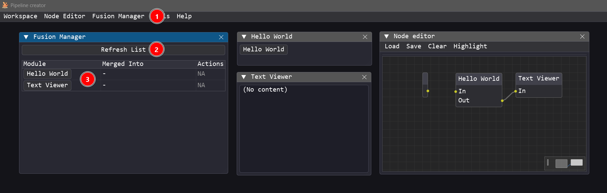
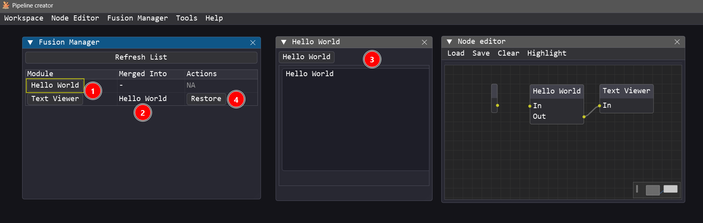
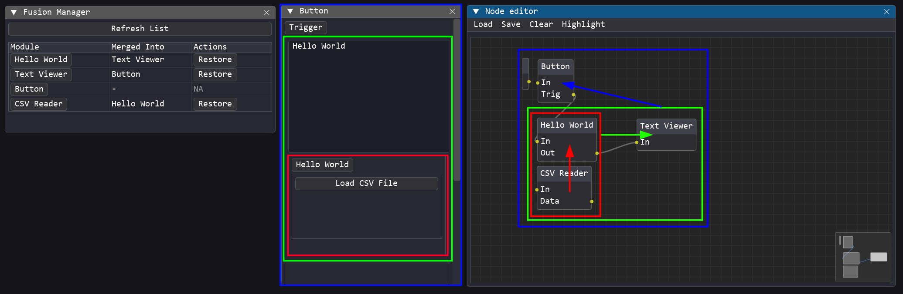

# Fusion Manager Guide

When working with many active modules, floating windows can clutter the workspace and overlap. The **Fusion Manager** is a visual layout helper that allows you to clean up your workspace by "docking" multiple independent module panels together into a single, unified window.

---

## Key Features

- 📁 **Tabbed Container**: Dock multiple windows into a single tabbed panel.
- ⚙️ **Quick Layout Rebuilding**: Save and re-apply docked arrangements.
- 🔄 **Dynamic Docking/Undocking**: Drag tab headers or use the manager interface to dock/undock panels on the fly.
- 🖥️ **Workspace Integration**: Docked layouts are persisted when saving the workspace.

---

## How to Use

### 1. Opening the Fusion Manager

*Ensure you are in **Advanced** or **Dev** privilege mode*

1. In the main menu bar, click **Fusion Manager**.
2. Clic on **Refresh** to update the list of active modules.
3. The current module will appear in the list.

### 2. Docking / Merging Modules

1. To dock a module into another, click and drag the source module's button from the **Module** column, and drop it onto the target module's button in the same column.
2. The **Merge into** column will show the name of the module that the current module is merged into. It will be blank if the module is not merged into any other module.
3. The source module will be merged into the target module, hiding the source standalone window and embedding its children inside a tab group within the target window.
4. To restore the original state of a windows click the **Restore** button in the **Actions** column.

### 3. Nested Merging

Pipeline Creator supports **nested merging (hierarchical docking)**. This means:

- You can merge module **A** into module **B** (so A becomes a tab inside B's window).
- You can then merge module **B** (which now contains A) into module **C** (so B and A both become tabs inside C's window).
- This creates multi-level hierarchies, allowing you to group related tools into tabs, and then group those tab panels into larger container windows to customize your workspace as you see fit.

To build a nested hierarchy in the Fusion Manager, simply drag the button of a container module (which already has other modules merged into it) and drop it onto the button of another module.

