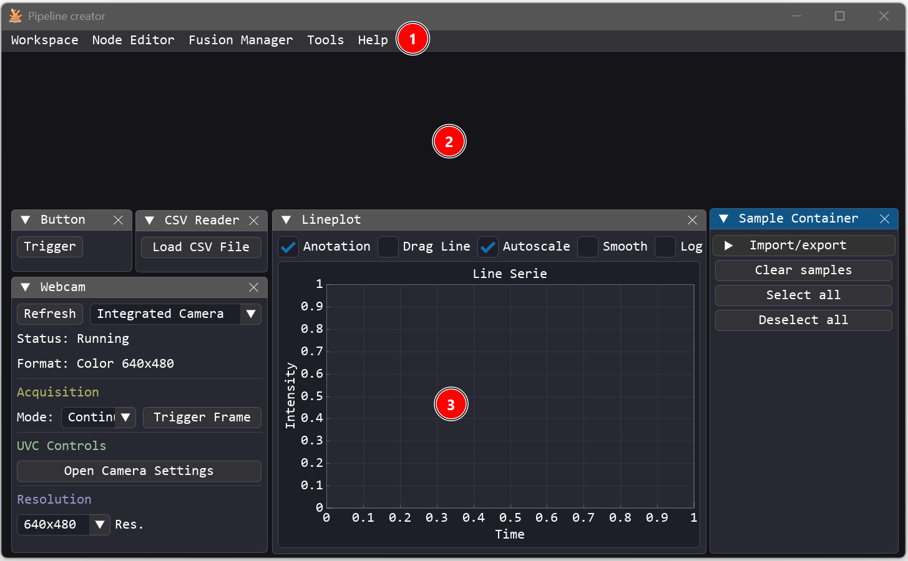
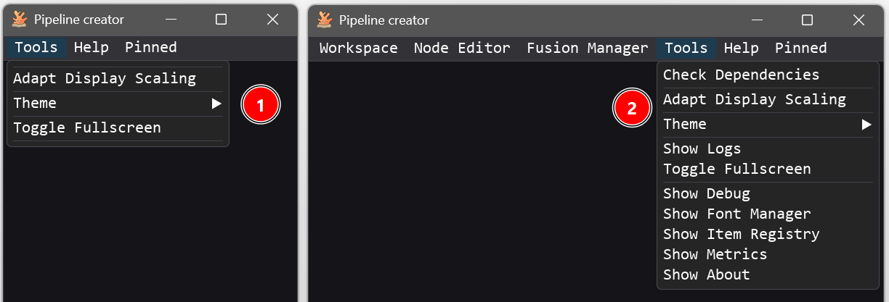
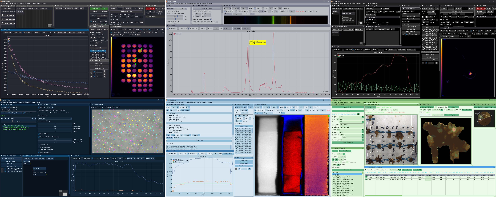
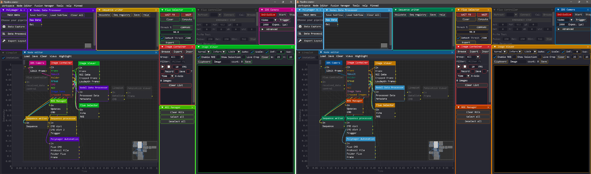
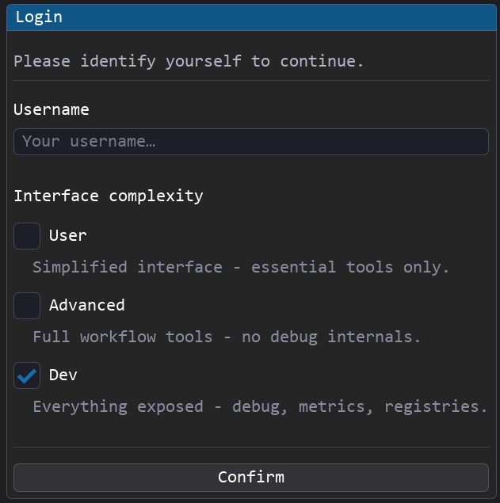
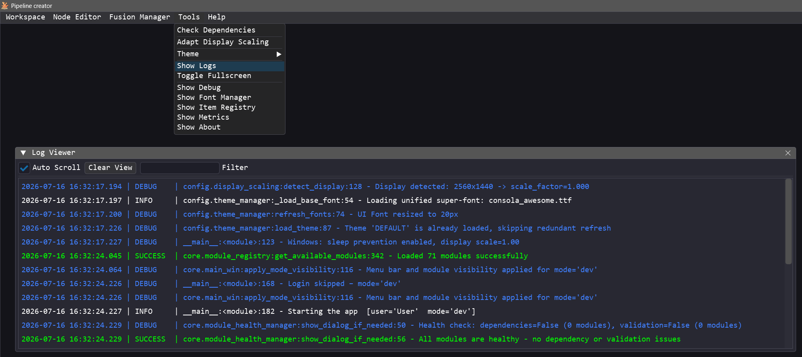

# <u>Main Window Guide</u>

The **Main Window** is the primary container of the application. It hosts the **menu bar** that gives access to all workspace management tools, visual editors, debugging utilities, and system settings.

---

## <u>Overview</u>

When Pipeline Creator starts, the Main Window occupies the full viewport and acts as a top-level host for all other panels. It contains:

1. A [**menu bar**](#menu-bar) at the top.
2. A transparent **background canvas** 
3. **Modules** float on top of it.



## <u>Menu Bar</u>

The active [privilege mode](#privilege-modes) has a direct impact on the availability and content of the different menus.



The following table summarizes all options in the menu bar along with their required privilege levels:

| Option / Menu | Privilege | Description |
|---|---|---|
| **Workspace** | Advanced, Dev | Allows loading and exporting pipelines or window layouts (*views*). |
| **Node Editor** | Advanced, Dev | Opens the [Node Editor](node_editor_guide.md). |
| **Fusion Manager** | Advanced, Dev | Opens the [Fusion Manager](fusion_manager.md). |
| **Tools** | User, Advanced, Dev | Access [theme controls](#themes), [display scaling](display_scaling.md), system debug/diagnostics panels, and the **[Module Manager](module_manager.md)** (Advanced and Dev modes only). |
| **Help** | User, Advanced, Dev | Access system documentation and the [Tutorial Manager](tutorial_manager.md). |
| **Pinned** | User, Advanced, Dev | Displays the list of currently pinned modules. |

---

## <u>Themes</u>

Pipeline Creator ships with multiple color palettes. Switch between them via **Tools → Theme**.



Themes are defined in `config/theme_colors.py` as Python dictionaries. Any dictionary with an ALL_CAPS name is automatically discovered and listed as an available theme.

```python
# Example palette definition in theme_colors.py
MY_CUSTOM_THEME = {
    "window_bg":       (20, 20, 30, 255),
    "title_bar":       (40, 40, 60, 255),
    "button":          (70, 130, 180, 255),
    "button_hover":    (100, 160, 210, 255),
    # ... more color keys
}
```

The active theme name is persisted in `config.json` under `UI.theme_name` and loaded on the next startup.


### Colorblind Support

Pipeline Creator includes colorblind-friendly palette variants. This colorization is especially helpful in the [Node Editor](node_editor_guide.md), where data flows, individual nodes, and their corresponding windows are color-coded to make the pipeline easier to understand. These color schemes can be adjusted to suit different types of color blindness.



Set `UI.colorblind_type` in `config.json` to one of:

| Value | Description |
|---|---|
| `"none"` | Default palette (no adjustment) |
| `"deuteranopia"` | Green-blind adjusted colors |
| `"protanopia"` | Red-blind adjusted colors |
| `"tritanopia"` | Blue-blind adjusted colors |

---

## <u>Fusion Manager</u>

The **Fusion Manager** is a visual helper panel that allows you to organize and clean up your workspace by combining multiple independent module panels into a single, unified tabbed window.

For more details on the layout system, see the dedicated [Fusion Manager Guide](fusion_manager.md).

### Accessing the Fusion Manager

1. Ensure the application is running in **Advanced** or **Dev** privilege mode.
2. In the main menu bar, click **Fusion Manager** to open its control window.

### Drag-and-Drop Docking

To combine floating windows:
- Locate the modules you wish to combine in the Fusion Manager table.
- Click and hold the module's button in the **Module** column.
- Drag and drop it onto another module's button within the same column.
- The dragged module's standalone window will automatically hide, and its controls will be embedded as a new tab inside the target module's window.
- **Nested Merging**: Hierarchical docking is fully supported. You can merge a module into another module, and then merge that container module into a third module (e.g., merging A into B, and then B into C), creating nested, multi-level tabbed groups.

### Quick Controls

Inside the Fusion Manager table, you can interact with the module buttons:
- **Left-Click** a button to bring that module's window to focus.
- **Right-Click** a button to trigger an automatic resize on that module's window.

### Undocking / Restoring Windows

To split a module back out of a tab group:
- Locate the merged module in the Fusion Manager list.
- Click the **Restore** button in the **Actions** column.
- The module will immediately be detached and restored as its own standalone floating window.

---

## <u>Privilege Modes</u>

Privilege modes control which UI features are accessible. 

Whether the login screen is displayed at startup is controlled by the `"Login"` section in `config.json`:
- `"enabled"`: Set to `true` to display the login dialog on startup, or `false` to skip it.
- `"default_mode"`: Specifies the fallback privilege mode (`"user"`, `"advanced"`, or `"dev"`) when the login dialog is disabled.

The login dialog can also be reopened at any time via the shortcut `Ctrl + Shift + L`.

When a user logs in, their username is stored in the global state container [app_state.py](core/app_state.py) (via the `app_state.username` attribute). This allows any module to retrieve the current username if needed (e.g., for user-specific logs, paths, or actions).

{ width="50%" }

Mode changes automatically:
- Hide/show menu items
- Call `update_permission()` on all active module instances
- Apply the mode's saved **view layout**

## <u>System Tray</u>

When `Window.minimize_to_tray` is `true` in `config.json`, the **Minimize to Tray** menu item appears. Clicking it hides the main window and places a tray icon. Right-clicking the tray icon shows a context menu to restore or quit.

---

## <u>Log Viewer</u>

Pipeline Creator includes an in-app **Log Viewer** window that captures and displays real-time application logs. This is extremely helpful for monitoring background processes or debugging custom modules.

- Ensure the application is running in **Advanced** or **Dev** privilege mode.
- In the main menu bar, go to **Tools** and select **Show Logs**.



### Features of the Log Viewer

- **Auto Scroll**: Automatically scroll to the latest log entries when checked.
- **Clear View**: Clear the current logs displayed in the viewer window.
- **Filter**: Enter a search query to filter logs dynamically in real time.
- **Color-Coded Severity**: Logs are colored based on their severity level (e.g. TRACE, DEBUG, INFO, SUCCESS, WARNING, ERROR, CRITICAL).
