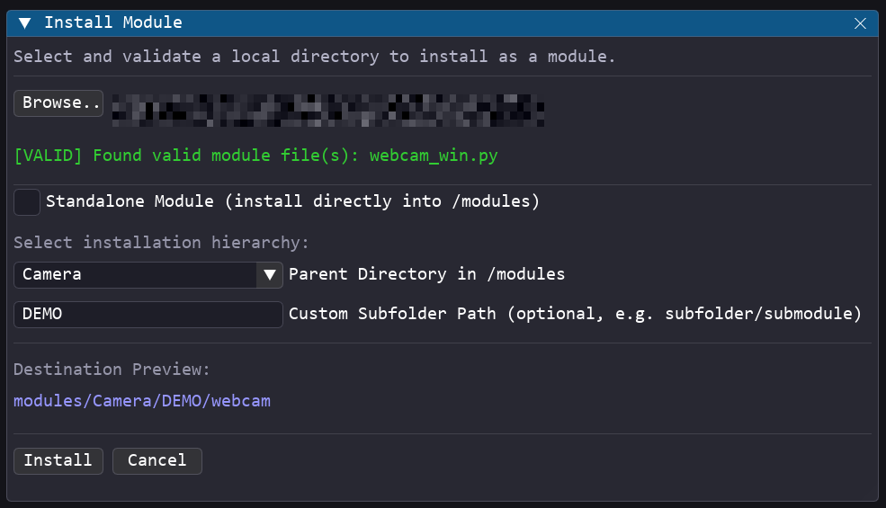

# <u>Module Manager Guide</u>

The **Module Manager** provides a safe and visual interface to **Install** and **Uninstall** custom modules directly from the Pipeline Creator GUI. 

## <u>Installing a Module</u>

The **Install Module** interface allows you to select a local folder, validate its contents, and copy it into the application's `/modules` directory.

1. Ensure you are logged in as **Advanced** or **Dev**.
2. Navigate to **Tools → Install Module** in the menu bar.

{width=50%}

- **Browse Folder**: Click the **Browse...** button to select a local folder containing your module.
- **Standalone Module**: Check this option to install the module folder directly into the root `modules/` directory (e.g., `modules/my_module/`).
- **Hierarchical Installation**: Uncheck **Standalone Module** to choose a nested directory structure:
    - **Parent Directory**: Select an existing subdirectory inside `modules/` (e.g., `Camera`).
    - **Custom Subfolder Path**: (Optional) Specify a nested subdirectory structure manually (e.g., `test/rtsp`), which will be created automatically.

Before allowing installation, the Module Manager runs several automated checks on the target directory:

1. **Module Presence**: Verifies the folder contains at least one Python file (`.py`).
2. **Export Verification**: Scans the Python files using static AST analysis to ensure at least one class is decorated or registered for export (e.g., defining `EXPORTED_CLASS`).
3. **Validation Success**: Once all checks pass, the status indicator turns green, and the **Install** button becomes active.

## <u>Uninstalling a Module</u>

The **Uninstall Module** interface lists all dynamic modules installed in `/modules` and allows you to permanently remove them.

1. Ensure you are logged in as **Advanced** or **Dev**.
2. Navigate to **Tools → Uninstall Module** in the menu bar.

{width=50%}

- **Hierarchical Directory Browser**: Modules are displayed in a clean, collapsing folder hierarchy matching their actual location under `modules/` (e.g. `Camera/webcam/webcam_win`).
- **Interactive Search Bar**: Enter a search query to filter the tree view dynamically. The folders will automatically expand to reveal matching modules based on a fuzzy search scoring system.
- **Hover Tooltips**: Hover your mouse cursor over any module button to immediately view its class description/docstring in a tooltip.
- **Visual Highlight**: Clicking a module button selects it for deletion, highlighting it with a `->` prefix.
- **Safety Resolution & Clean-up**:
    - **Shared Folders Safeguard**: The uninstaller automatically compares the selected module's file path against other registered modules. If other modules share the same folder, it will only delete the selected module's specific `.py` file, preserving the folder and other modules.
    - **Empty Parent Cleanup**: If the deleted module was the last one in its folder hierarchy (e.g., in `modules/test/test/`), the uninstaller recursively deletes those empty parent folders up to `modules/` to avoid cluttering the repository.
    - **Permissions & Cache Bypass**: Automatically manages read-only folder attributes and ignores locked Python `__pycache__` locks under Windows to guarantee a clean and successful deletion.

---

## <u>Dynamic Registry Refresh</u>
Both installation and uninstallation actions automatically:
1. Re-scan the `/modules` folder.
2. Invalidate the global module registry cache.
3. Refresh the **Node Editor** search lists in real time.

You can instantly search and place your newly installed modules in the Node Editor, or verify that uninstalled modules are removed, without needing to restart the application.
