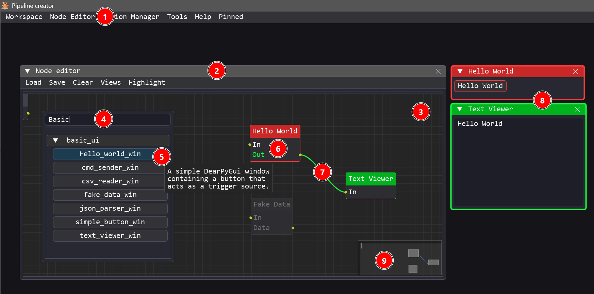
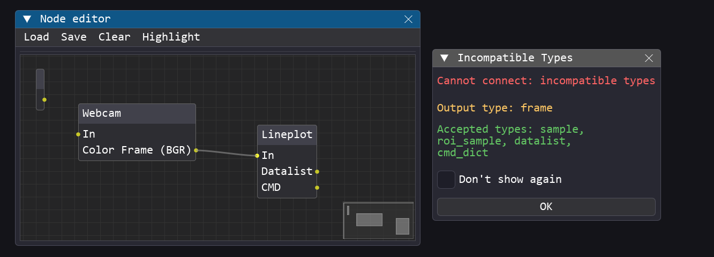
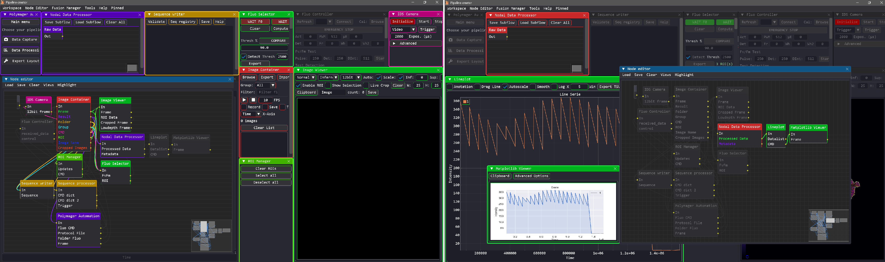
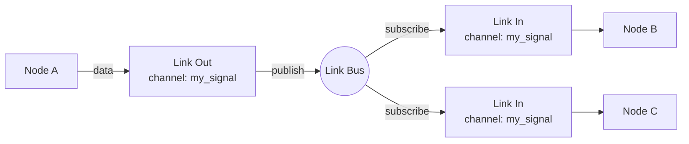
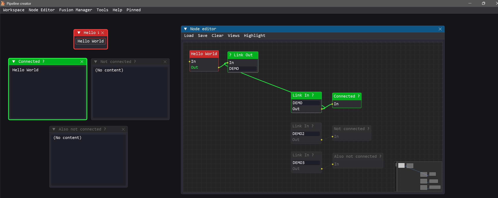

# <u>Node Editor Guide</u>

The **Node Editor** is the central workspace of Pipeline Creator. It is a visual canvas where you import, connect, and configure **node modules** to build custom pipelines. These pipelines can orchestrate control flows, process data, manage hardware interactions, or run visualization routines.

- **Module Connectivity**: Each module is equipped with a single input terminal and can have one or more output terminals.
- **Custom Logic**: Modules can contain arbitrary code and logic. They may include a graphical user interface (GUI) window, or run entirely in the background as invisible processing units.
- **Automated Data Transfer**: The link bus and wire routing system that handles data transfer between modules is completely automated by Pipeline Creator.
- **Interoperability & Future-Proofing**: To ensure modules remain compatible and interoperable, a standardized [Input/Output typing system](developer_guide.md#iotypes-reference) validates each connection.

---

## <u>Opening the Node Editor</u>



1. The editor can be launched from the **Main Window menu bar** via **Node Editor** (requires *Advanced* or *Dev* privilege mode).
2. The editor runs as a floating, resizable window within the viewport, allowing it to be moved, scaled, or docked.
3. An infinite, pannable, and zoomable workspace where node modules are instantiated, repositioned, and linked.
4. Right-clicking anywhere on the empty canvas opens the Module Search Popup. It allows you to search for specific modules and browse available categories (fuzzy matching supported).
5. Hovering over any module in the search list displays its custom documentation string as a tooltip.
6. Clicking a module from the search list instantiates the node, placing it on the canvas exactly at the current mouse pointer position.
7. Wires can be drawn between modules by clicking and dragging from an output terminal to an input terminal. Connections can be deleted/destroyed by holding `Ctrl` and clicking the wire (`Ctrl + Left Click`).
8. Once a module is instantiated, its corresponding control window appears. Double-clicking a module's node on the canvas brings its corresponding window to the foreground.
9. The minimap helps you navigate and orient yourself in large, complex flow graphs.

!!! note "Module Auto-Discovery & Validation"
    Modules are automatically detected, validated, and loaded at startup (see [Developer Best Practices](developer_guide.md#developer-best-practices)) from the `/modules` folder structure. Modules are grouped by **category** (their parent folder inside `/modules`)

| Action | How |
|---|---|
| **Pan** | Hold `Middle Mouse Button` and drag, or scroll while hovering |
| **Move node(s)** | Drag a selected node header |
| **Focus window** | Double-click a node to bring its corresponding module window to the foreground |
| **Context menu** | `Right clic` on a node pops up a context menu thaht allows to display the module tutorial, rename the node, send to pinned modules or delete the node/module.  |

Every Input/Output has a declared **IOType** (e.g. `NUMBER`, `FRAME`, `TRIGGER`, `CMD_DICT`). When you attempt to connect incompatible types, the editor will show a **warning modal** explaining the mismatch. Compatible connections are accepted silently.



## <u>Highlighting & Dimming</u>

When you select a node, Pipeline Creator highlights its **downstream graph** to make the data flow visible.

The highlighting mode is configurable via **Node Editor → Highlight** menu:
| Mode | Effect |
|---|---|
| **Show All** | Highlights the complete downstream chain |
| **Closest** | Highlights only directly connected nodes |
| **None** | Disables highlighting |




Nodes that have *no* connections are **dimmed** to indicate they are inactive.

---

## <u>Built-in Nodes: Link In / Link Out</u>

These special nodes allow you to route data between modules without drawing a physical wire. Instead of a wire, they transmit data by matching **channel names**. This is especially useful when the output of a single module needs to feed into multiple other modules, preventing the visual workspace from being cluttered with dozens of crisscrossing wires.

Set the exact same **channel name** on a *Link Out* node and one or more *Link In* nodes to automatically link them.


Clicking on a **Link Out** node automatically draws and highlights temporary virtual links on the canvas, allowing you to easily trace the "wireless" connections to all subscribed **Link In** nodes.



!!! warning "No IOType Validation on Virtual Wires"
    Unlike standard node terminals, **Link In** and **Link Out** nodes do not perform compatibility checks on `IOTypes`. They use the generic `ANY` type, which theoretically allows connecting incompatible modules. 
    
    To avoid run-time errors, it is recommended to first prototype your flow using physical wires (which validates the data types), and then replace those wires with Link In/Out nodes to clean up the canvas.

---

## <u>Saving & Loading Flows</u>

### <u>Node Editor Menu Bar</u>

| Menu | Item | Description |
|---|---|---|
| **Load** | Flow… | Open a `.json` workspace file (replaces current graph) |
| **Load** | Reload Last Flow | Quickly reload the last opened file |
| **Load** | Subflow… | *Append* nodes from a file without clearing existing ones |
| **Load** | From Clipboard | Paste a JSON flow copied from another session |
| **Save** | Flow to File… | Export the entire workspace to a `.json` file |
| **Save** | Flow to Clipboard | Copy the serialized workspace to the clipboard |
| **Clear** | Clear All Nodes | Delete every node and link |
| **Clear** | Clear Selection | Delete only selected nodes |

### <u>Flow File Format</u>

Workspaces are stored as human-readable JSON:

```json
{
    "is_relative": true,
    "windows": [
        {
            "uuid": "41680190-3cb8-4a57-b08f-287df5d1bf2b",
            "module": "modules.basic_ui.csv_reader_win",
            "pos": [15.2, 20.4],
            "size": [30.5, 40.0],
            "visible": true,
            "params": {
                "default_path": "data/samples.csv"
            }
        }
    ],
    "connections": [
        {
            "from": "41680190-3cb8-4a57-b08f-287df5d1bf2b",
            "output": "CSV_DATA",
            "to": "50c3d9a4-2e91-4c17-910a-3cb7217fd8b2"
        }
    ]
}
```

| Field | Description |
|---|---|
| `is_relative` | If `true`, `pos`/`size` are screen percentages (portable across resolutions) |
| `uuid` | Unique identifier for the node instance |
| `module` | Python import path of the module class |
| `params` | Saved values from the module's `_persistent_fields` list |
| `connections` | Wires between output terminals and destination nodes |

---

## <u>Views</u>

**Views** are named window layout presets (position + size for each module) that can be saved and applied per privilege mode.

- **Export View**: `Main Window → Workspace → Export View…`
- **Apply View**: `apply_view(mode_name)` is called automatically on login/mode change.
- Views allow you to have a "User layout" (simplified) and a "Dev layout" (all panels visible) saved independently.
