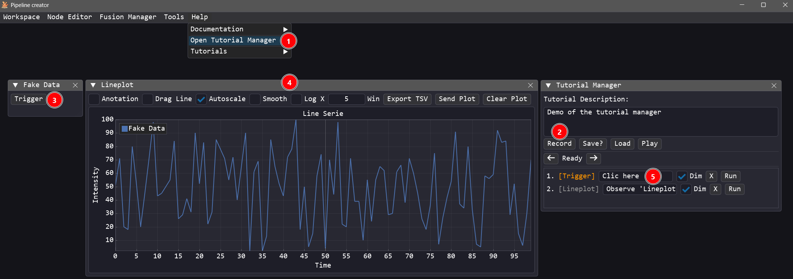
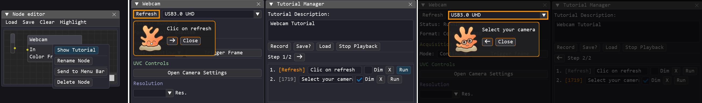

# Tutorial Manager Guide

When working with complex pipelines the interface can quickly become intimidating for new operators. The **Tutorial Manager** is a visual utility designed to simplify this complexity. It allows you to record and replay step-by-step interactive tutorials that guide operators through a pipeline's interface by dimming the entire screen, drawing a high-contrast orange border around the active control widget, and displaying a floating instruction card featuring a helpful mascot.

---

## Key Features

- 🎥 **Live Recording**: Record actions on sliders, buttons, inputs, menus, and combos in real time.
- 👁️ **Observation Points**: Record static highlight boxes to focus the user's attention on non-interactive elements (e.g., checking a plot or status indicator).
- 🔆 **High-Contrast Focus**: Dims the rest of the screen and draws a glowing border around the active widget.
- 🦖 **Customizable Mascot**: Displays instructions next to the active item accompanied by a mascot. By default, it uses Polypy, but you can configure a custom mascot/icon by placing your image files under `ressources/tutorial_assets/`.
- 💾 **Portable JSON Format**: Tutorials are stored as portable JSON files in the `config/tutorials/` directory, allowing them to be shared across setups.
- 🛠️ **Programmatic Workflow Enforcement**: Developer modules can block actions in specific privilege modes (such as `"user"` mode) if a prerequisite is not met, and automatically trigger an overlay reminder highlighting the exact widget the user must interact with.

---

## How to Use

Creating a tutorial is fully automated: you simply start the recording, interact with the UI elements in the sequence you want to demonstrate, and then write the custom instructions that should appear on screen for each step.

1. Open the Tutorial Manager.
2. Click the **Record** button.
3. **Left-Click** any interactive widget (buttons, sliders, inputs) to record an **Interact** step.
4. **Middle-Click** any static element (titles, charts, status texts, window) to record an **Observe** step.
5. For each step:
   - Customize the instructions by editing the text field next to the step.
   - Check or uncheck **Dim** to toggle whether the screen should dim during this step.
   - Click the **Run** button to test that specific step.
   - Click the **X** button to delete a step.

To run a tutorial:

1. Open the Tutorial Manager.
2. Click the **Load** button and select a tutorial JSON file.
3. Click **Play** (or **Stop Playback** to cancel).
4. A floating instruction HUD will appear on screen:
   - For **Interact** steps: perform the highlighted action (e.g., clicking the button) to automatically advance to the next step, or click the **Next (→)** button on the HUD.
   - For **Observe** steps: hover your mouse cursor over the highlighted element to automatically advance, or click the **Next (→)** button on the HUD.
   - Click the **Prev (←)** button on the HUD to go back a step.
5. Click **Close** or **Stop Playback** at any time to exit the tutorial.

During playback, the Tutorial Manager includes an integrated **task validation system** that monitors user actions in real time. When a step highlights a widget (such as a button or slider), the manager detects when the user performs the required interaction on that widget and automatically validates the task to advance to the next step.

---

## Module-Specific Tutorials

Pipeline Creator allows you to link tutorials directly to custom modules:

- Place a file named `tutorial.json` in the same directory as your module's Python file (e.g., `modules/my_module/tutorial.json`).
- The Node Editor automatically detects this file at startup.
- In the Node Editor canvas, right-click on the module's node to open its context menu.
- A **Show Tutorial** button will automatically appear at the top of the context menu.
- Clicking **Show Tutorial** will immediately load and play that module's specific tutorial.

!!! note "Dimmed vs. Non-Dimmed View"
    You can also see the difference between a Dimmed and Non-Dimmed step.
